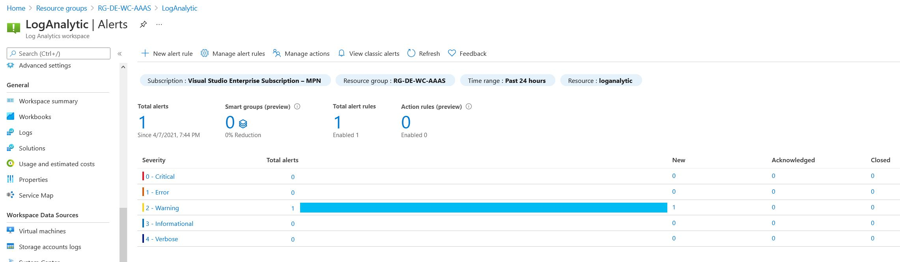

# Exercise 6: Secure Your Virtual Network Infrastructure

### Subdirectories

* **Folder "img"** contains screeshots for git readme file.

* **Folder "access_manager"** contains terraform modules for access management and control tasks.

* **Folder "compute_resources"** contains terraform module for VM deployment tasks.

* **Folder "networking_resources"** contains terraform modules for networking and SG deployment tasks.

* **Folder "storage_resources"** contains terraform module for storage deployment tasks.


### Solutions for every tasks are listed below:
###### Task 1: Traffic filters

  You can find network security group settings in [security module](https://github.com/EugeneDimitrov/ipspace-npcd-exercises/tree/main/EX_06/networking_resources/modules/security/).

###### Task 2: Identity and Access Management

  You can find permission setting for user in [iam module](https://github.com/EugeneDimitrov/ipspace-npcd-exercises/tree/main/EX_06/access_manager/modules/iam/).

###### Task 3: Application firewall

  You can find WAF settings in [network module](https://github.com/EugeneDimitrov/ipspace-npcd-exercises/tree/main/EX_06/networking_resources/modules/network/)  under "create application gateway" section
  Use this URL http://appgw.germanywestcentral.cloudapp.azure.com to check how it works.

###### Task 4: Session logging

  In this solution I'm using "Log Analytics Workspace" (LAW) which is tracking auth logs from jumphost VM.
    Every 5 min LAW checking jumphost VM auth syslog messages using this query:
  ```
  Syslog
  | where SyslogMessage startswith "Accepted publickey for azure from"
  ```
  If this query returns any result then LAW generates Alarm:
  