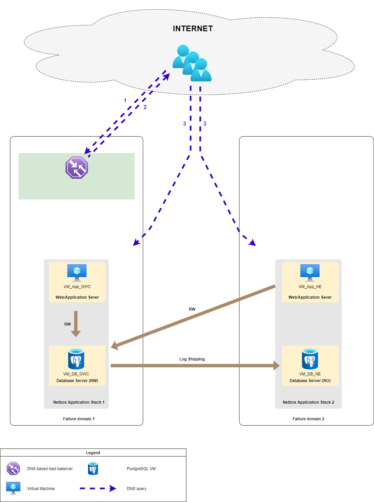
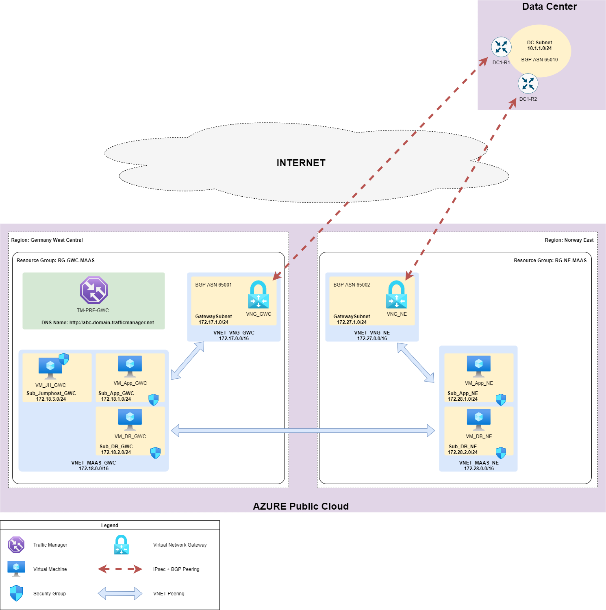

# Final Exercise (Optional): Deploy Netbox application in redundancy mode

In this exercise I deploy [Netbox](https://netbox.readthedocs.io/en/stable/) application. The requirements are listed below:

* The application should be available for external (company partners and external auditors) and internal users (IT administrators and managers).
* There should be secure and redundant connectivity to our on-premises data center for backup and maintenance purposes.
* Any network communications which is not used by deployed services must be blocked. All VMs must have direct Internet access for update purposes.
* The NetBox service must support high availability: 
  * Every component of application must be reserved. 
  * The application should be distributed over two Azure regions and support DNS based load sharing.

## The Architecture
To meet high availability requirements I decided to use "swimlanes" approach, so the architecture looks as follows:


In this image:
- VM_App_GWC and VM_App_NE are used as web and application servers for Netbox service.
- VM_DB_GWC and VM_DB_NE are two database servers powered by PostgreSQL 12. Also there is a database replication configured between the two. So VM_DB_GWC act as read/write database instance while VM_DB_NE is read only.
- DNS based load balancer which is providing application availability to users between fault domains.

Using Azure Cloud services target topology will be:


In this diagram:
- I'm using separate VNETs for VNG and application services (this makes it look sophisticated but it was made due academic interest).
- To make database replication work, VNET_MAAS_GWC and VNET_MAAS_NE were peered together. I also peered VNG and application VNETs for on-premises data center connectivity.
- Each VNG has BGP connectivity with on-premises data center border routers.
- Azure Traffic Manager act as a DNS based load balancer to make user connections to both sites redundant.
- Access to application VNETs secured using security groups.
- VNET_MAAS_GWC has dedicated secured subnet for jumphost VM. This VM will be used for initial application VM setup using Ansible playbooks.

## Deployment Steps

### To Do First

**Step 1**. Change several veriables:

* in .variables.ft

```
#Change this to allow connection to jumphost from your PC. Example: default = ["234.11.234.88"]
variable "user_pub_ip" {
  type    = list(any)
  default = ["*"]
}

#Input correct DC lan prefix
variable "dc_lan_sub" {
  type    = list(any)
  default = ["10.1.1.0/24"]
}

#Change this to correct Data Center BGP peer addresses. Example: default = "234.11.234.88"
variable "bgp_dc1_r1" {
  type    = string
  default = "2.3.4.14"
}

variable "bgp_dc1_r2" {
  type    = string
  default = "2.3.4.15"
}

#Change this to correct IPsec PSK value. 
variable "ipsec_sec_key" {
  type    = string
  default = "Change_me!!!"
}
```

**Step 2**. Generate certificates for Netbox web servers and put resulting files to ./ansible/ folder:

```
sudo openssl req -x509 -nodes -days 365 -newkey rsa:2048 \
-keyout ./netbox.key \
-out ./netbox.crt
```
**Step 3**. Run terraform apply.

### The Final Steps

**Step 0 (optional)**. Activate ansible venv. For example:
```
source ~/venvs/ansible-latest/bin/activate
```

**Step 1**. Update and prepare all VMs for application install using 00_vm_postinstall.yml playbook:

```
ansible-playbook 00_vm_postinstall.yml
```

**Step 2**. Install and configure database VMs. Do not use the password from the example. Choose a strong, random password to ensure secure database authentication for your NetBox installation.

Example:
```
ansible-playbook 01_db_init.yml -e "replication_user_pass=Change_me!!! netbox_user_pass=Change_me!!!"

```
**Step 3**. Install and configure Netbox application VMs. **netbox_user_pass** var values must match between this and previous steps. **netbox_secret_key** value must be unique to this installation and it is recommended to be at least 50 characters long.

```
ansible-playbook 02_app_init.yml -e "netbox_user_pass=Change_me!!! netbox_secret_key=BbQ!GOEYyf?)'5"9$pvH4;<N8=Zt%_]5p(,0~S`+UBXG,Jj;G^"
```
## Deployment Checks
Netbox service shoud be accessible by this URL https://abc-domain.trafficmanager.net/, even if you shutdown any single VM or entire Azure region at this deployment.
